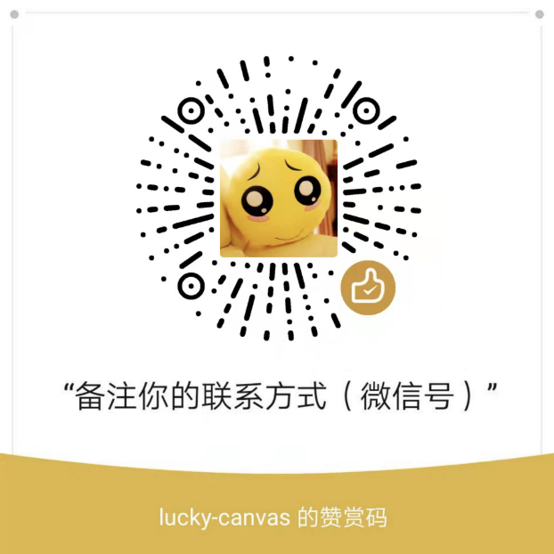

  
   
  <h1 style="margin: 10px 0 0">Mini Sandbox</h1>
  
一个前端【代码/组件】的可视化方案，融合了【在线编辑 & 实时预览】等特点

  

    
    
    
    
    
  

 

## Feature & 功能亮点 <!-- {docsify-ignore-all} -->

- 可以在线编辑 `html` | `css` | `js` 代码, 并实时预览代码效果
- 代码自动保存到 URL 上, 支持自定义短链, 分享网址即可分享代码
- 静态资源全局缓存, 多个 sandbox 之间资源共享, 拒绝浪费请求
- 支持动态 import / export 引入或导出其他标签页的代码
- 支持【 [`Vue SFC`](https://buuing.github.io/mini-sandbox/vue-sfc.html) / [`React SFC`](https://buuing.github.io/mini-sandbox/react-sfc.html) 】单文件组件
- 纯前端部署, 不依赖服务器, 静态页即可实现代码/组件的预览

 

## Document & 官方文档

- [官方文档 & 演示地址](https://buuing.github.io/mini-sandbox)

 

## Usage & 使用

- [在 javascript 中使用](https://buuing.github.io/mini-sandbox/#/docs/usage)
- [在 docsify 中使用](https://buuing.github.io/mini-sandbox/#/docs/usage-docsify)

 

<!-- ## 赞赏码

- **Bug 反馈请直接去 Github 上面提 Issues,** 我会实时收到邮件提醒前去查看
- 如果是小白需要技术指导的话, 下边是我的赞赏码, **备注好你的微信号,** 我看到后会主动加你
- 但如果是因为我文档没写清楚，或者是插件本身的bug，导致你无法正常使用的话，赞赏全额返还

**请备注好你的`微信号`** -->

 

## 谁在使用

- [🎁 lucky-canvas 【大转盘 / 九宫格 / 老虎机】抽奖插件](https://100px.net/playground.html)
- [🎁 right-menu 一个功能强大的右键菜单插件](https://buuing.github.io/right-menu/#/docs/options)

> 欢迎通过 PR / ISSUES 补充（要求链接地址为使用该插件的页面）

 
